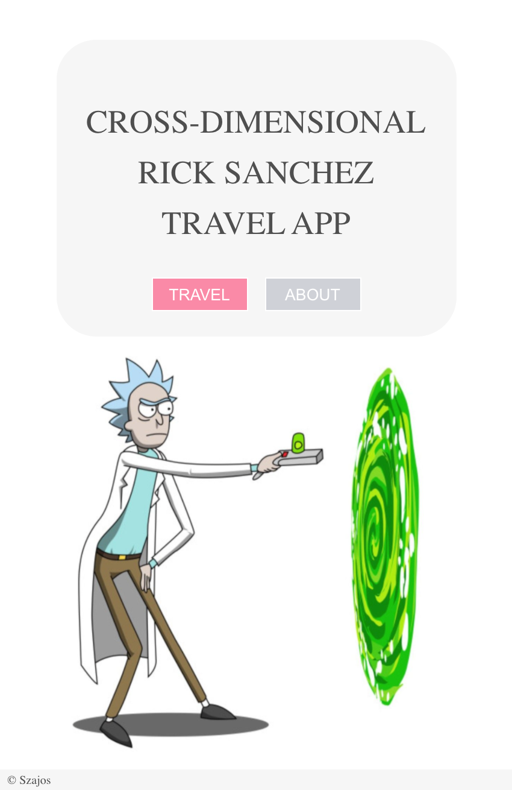
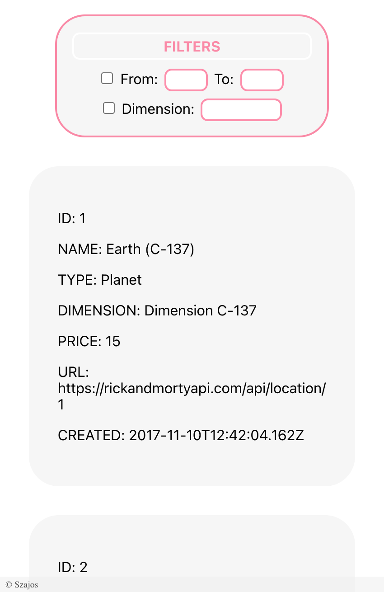
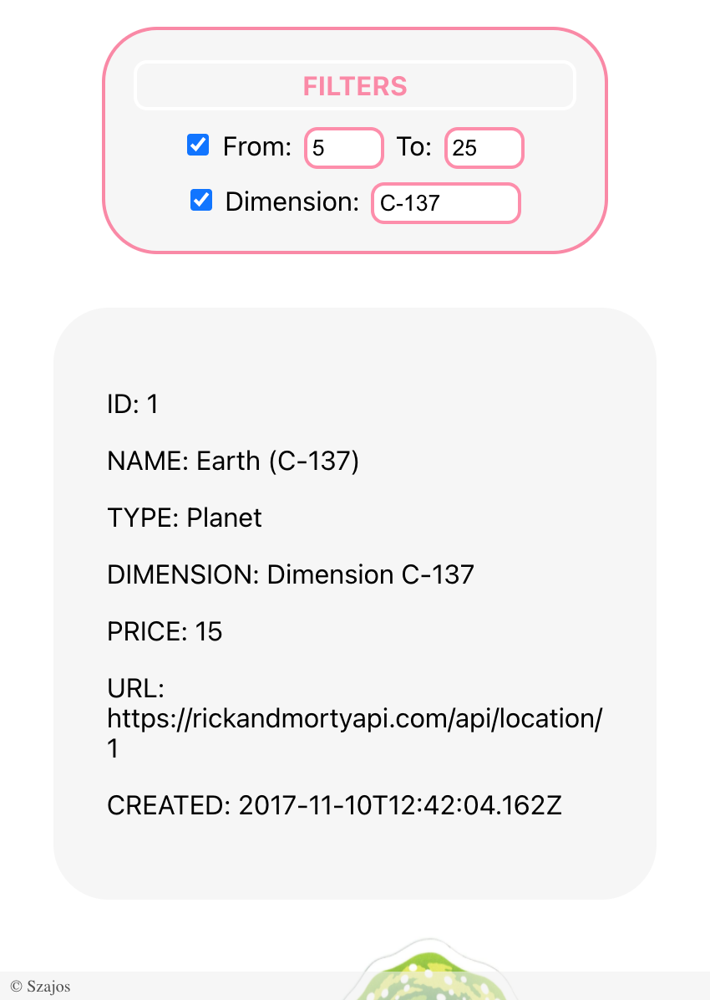

# Cross-Dimension Rick Sanchez Travel App

## Table of contents
* [General info](#general-info)
* [Technologies](#technologies)
* [Demo](#demo)
* [Features](#features)
* [Screenshots](#screenshots)

## General info
Time for travel? Navigate between dimensions and go for a ride with Rick. App keeps all dimensions stored in one place, allows to filter them by price or dimension name, check place by ID, create new or update the existing one.

First App written in React. \
Backend (https://github.com/kSzajo/react-travel-app-backend) is deployed from master branch and has hardcoded data. On **sqlite** branch I practised basic SQL queries. \
Data source: The Rick and Morty API (https://rickandmortyapi.com/).

## Technologies
**Frontend:** React, JavaScript, CSS\
**Backend:** Vanilla TypeScript

## Demo
https://travel-app.aneta.szajowska.net/

## Features
* Browse places
* Get place by id
* Filter places by price or dimension name
* Create new place (sqlite branch)
* Update place (sqlite branch)

## Screenshots

